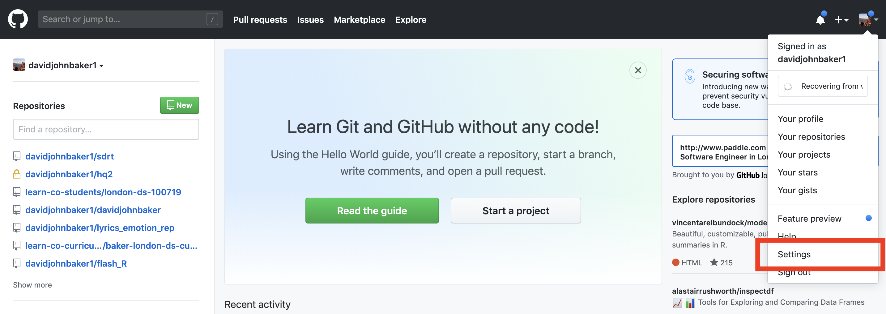
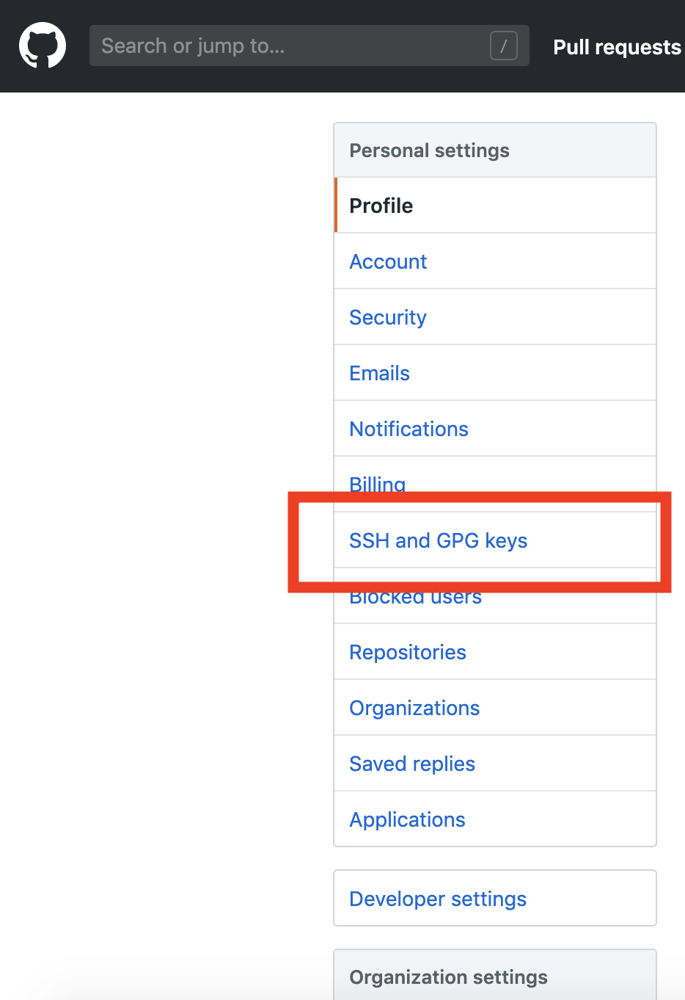
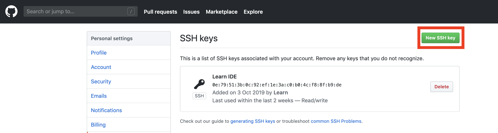
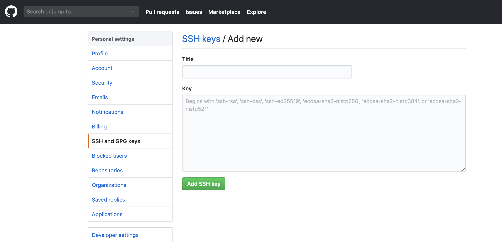

# Setting up Your SSH key with Github

In updating your learn-env, you might get an error that says that you do not have permission to pull a certain repo from Github. 
The error might look like something like this:

```
Cloning into ‘dsc-data-science-env’...
The authenticity of host ‘github.com (140.82.118.3)’ can’t be established.
RSA key fingerprint is SHA256:nThbg6kXUpJWGl7E1IGOCspRomTxdCARLviKw6E5SY8.
Are you sure you want to continue connecting (yes/no)? yes
Warning: Permanently added ‘github.com,140.82.118.3’ (RSA) to the list of known hosts.
git@github.com: Permission denied (publickey).
fatal: Could not read from remote repository.
Please make sure you have the correct access rights
and the repository exists.
```

Getting this error suggests that you have not yet linked your local git with your GitHub account via [ssh](https://en.wikipedia.org/wiki/Secure_Shell).
This tutorial will show you how to fix this problem and explain what each command is doing.

## Checking Current Status

After getting this error, the first thing that you want to do is to double check that there is an ``ssh`` file in your home directory.
You can run this with:

```
ls -a ~/.ssh
``` 

Confirm that your directory structure is as follows:
```bash
.ssh
├── id_rsa
├── id_rsa.pub
└── known_hosts
```

If the above isn't true (where `id_rsa.pub` is your _public key_ and `id_rsa` is your _private key_), it means that you have yet to create a keypair to link your local computer to any remote locations via ssh.
If you do have the above or something similar, then there is probably another problem!

## Generate Key 

Assuming nothing shows up, the first thing you need to do is to generate an ssh key.
You can run this with the following command.

```bash
ssh-keygen -t rsa

```

You can just press ``<RETURN>`` when prompted to accept the defaults; there is no need (for the moment) to set up a specific filename or passcode.

This will create a key that you will use to link your local computer to some sort of remote location.
Note that this makes a PUBLIC and a PRIVATE key.
You *never* want to give out your PRIVATE key, only your PUBLIC key.

With our key generated with the command above, we can now copy the contents of ``id_rsa.pub`` to our clipboard with the command:

```bash
pbcopy < ~/.ssh/id_rsa.pub
```

This is basically opening, highlighting the contents of ``id_rsa.pub`` and then copying the file contents to your clipboard in one fell swoop at command line.
With this now in our clipboard, we then go to Github to finish our linking

Type in `man ssh-keygen` to learn more about the ssh-keygen tool.
Type in `man pbcopy` to learn more about the ssh-keygen tool.

## Linking with Github

Next, we navigate to [Github.com](www.github.com) and need to first go to Settings, then click the side panel that is SSH and GPG Keys.
From here, click the Green SSH key.
The following screenshots can direct your clicking!







From this screen, you then want to right click and paste the contents of your clipboard to this text field.
You can also give this a title so you can keep track of your keys and what local computers that belongs to.

Once you then save this, you can then test that it works by running

```bash
ssh -t git@github.com
```

Accept the prompt to add a new key to your known hosts by pressing `<RETURN>`.
The above will confirm that your local computer can now communicate with your GitHub account by saying something like the following:

```bash
Hi <your GitHub username>! You've successfully authenticated, but GitHub does not provide shell access.
```


